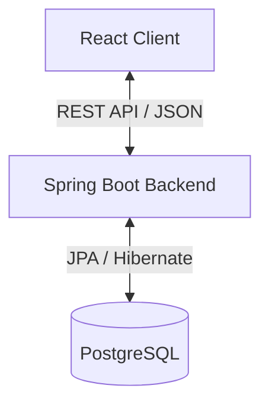

Benjamin Bacalete
Individual Project, 2025 - 2026 Instruction Manual

This manual contains a synthesis of the topics throughout the semester and presents the **Askademic** project in a detailed manner, as if it were intended for an interested client.

# Introduction (Requirements / Short Description)
This application is intended for educational institutions, professors, and students who wish to **streamline the learning experience through a centralized platform**. The main purpose is to **facilitate course management, efficient communication via Q&A, and content organization**. 

The primary functionalities of the application include:
*   **Course Management** – Professors can create courses, and students can enroll using unique codes.
*   **Q&A System & AI Smart Grouping** – Students can ask questions (anonymously or publicly). Similar questions are automatically grouped using AI to save professors time.
*   **Answer Verification** – Professors can verify correct answers, ensuring students rely on accurate information.
*   **Real-time Notifications & Announcements** – Users receive updates about new courses, answers, and important announcements.
*   **Role-Based Access Control** – distinct permissions for Students, Professors, and Administrators.

By using this application, users will benefit from **a clearer structure of study materials, faster answers to their questions, and an intuitive, modern user interface**.

# Design
The application architecture is based on the following technologies:
*   **Backend:** Spring Boot (Java) - providing robust REST APIs, Security (JWT), and async processing.
*   **Frontend:** React (JavaScript) - offering a dynamic, responsive Single Page Application (SPA).
*   **Database:** PostgreSQL 15 in Docker - storage for relational data, with `pgvector` extension for AI features.

## Communication Architecture
*   **TCP Sockets:** All client-server communication occurs over TCP socket connections (port 8080 for backend, port 5431 for database).
*   **REST API:** CRUD operations (Create, Read, Update, Delete) are exposed via RESTful endpoints over HTTP.
*   **Asynchronous Processing:** Background tasks (notifications) use Spring's `@Async` for non-blocking execution on separate threads.

## Why Docker?
Docker provides environment consistency and simplified setup:
*   **One-command setup:** `docker-compose up -d` starts the database
*   **No local installation:** PostgreSQL with pgvector runs in an isolated container
*   **Reproducible:** Everyone (developers, testers, graders) has the exact same database environment
*   **Easy cleanup:** `docker-compose down -v` removes everything

# Diagrams
The system follows a standard 3-tier architecture:



*   **Client** handles user presentation and interaction.
*   **Server** processes business logic, authenticates users, and handles database transactions.
*   **Database** stores persistent data including users, courses, questions, and embeddings.

# Implementation
To download and continue the development of the application, the client can follow these steps:

1.  **Cloning the repository:**
    ```bash
    git clone https://github.com/Benni8804/Askademy.git
    cd The_Student_Hub
    ```

2.  **Prerequisites:**
    *   Java 17+ (JDK)
    *   Maven 3.8+
    *   Node.js 18+ and npm
    *   Docker Desktop (for PostgreSQL database)

3.  **Starting the Database (Docker):**
    ```bash
    docker-compose up -d
    ```
    This starts PostgreSQL 15 with pgvector on port 5431.

4.  **Starting the Backend:**
    The backend provides different running modes:

    *   **Normal Mode (Production/Dev):** Uses persistent data.
        ```bash
        cd backend
        mvn spring-boot:run
        ```

    *   **Demo Mode (Add Sample Data):** Adds sample users and content if missing.
        ```bash
        mvn spring-boot:run "-Dspring-boot.run.profiles=demo"
        ```

    *   **Reset Mode (Wipe Data):** Wipes the database and re-seeds it. **Warning: Deletes all data!**
        ```bash
        mvn spring-boot:run "-Dspring-boot.run.profiles=reset,demo"
        ```

5.  **Starting the Frontend:**
    ```bash
    cd frontend
    npm install   # First time only
    npm start
    ```
    The frontend runs on http://localhost:3000

6.  **Running Tests:**
    ```bash
    cd backend
    mvn test
    ```

7.  **Accessing the Database (Optional):**
    ```bash
    docker exec -it askademy-postgres psql -U askademy_user -d askademy
    ```
    Useful commands: `\dt` (list tables), `\d tablename` (describe table), `\q` (quit)

# Usage
Below are examples of how the application works and how the user can access its features.

## 1. Authentication and Registration
*   **Registration:** New users can sign up as Students or Professors. Input data is validated (email format, password strength).
*   **Login:** Users log in securely; the session is managed via JWT tokens.

## 2. Interface Navigation
*   **Dashboard:** The main landing page showing enrolled courses for students or teaching courses for professors.
*   **Sidebar/Navigation Bar:** Provides quick access to "My Courses", "All Courses", and user profile settings.

## 3. Using Main Functions

### Creation and Management of Courses
*   **Professors** can click "Create Course" to add a new subject.
*   **Management:** Professors can edit course details or delete courses they no longer teach.
*   **Enrollment:** Students enter an 8-character code provided by the professor to join a course.

### Q&A and Data Processing
*   **Asking Questions:** Within a course, users can post questions. Use the "Ask Question" button.
*   **AI Grouping:** The application processes question text using vector embeddings. The "Smart Grouping" feature allows professors to see clustered similar questions and answer them in bulk.
*   **Answering:** Detailed answers can be provided by anyone; Professors verify the best answer to highlight it.

### Personalization of User Settings
*   **Theme:** Toggle between Light and Dark mode for visual comfort.
*   **Profile:** Users can update their basic information.

## 4. Usage Examples

### Adding a new Course
1.  Log in as a Professor.
2.  Navigate to the Dashboard.
3.  Click the "+" or "Create Course" button.
4.  Enter "Advanced Java Programming" and a description.
5.  Share the generated code (e.g., `JAVA2026`) with students.

### Filtering and Searching
*   **Search Bar:** Filter questions or courses by keyword.
*   **Status Filters:** Quickly view "Unanswered" questions to prioritize work.

# Conclusions and Next Steps
This application provides a robust solution for **modern academic environments**. Users benefit from an **optimized and efficient experience**, and the application can be improved by:
*   **Adding File Attachments:** Allow uploading PDFs or images to questions/answers.
*   **Mobile App:** Developing a native mobile version for better on-the-go access.
*   **Analytics Dashboard:** providing professors with detailed stats on student engagement.
